- CycleGAN을 이용한 Unpaired 근적외선 얼굴 이미지 생성 및 평가
- Generation and Evaluation of Unpaired Near-Infrared Face Iamges Using CycleGAN

---

### Abstract

- 얼굴인식은 조명 변화에 따라 인식성능이 크게 좌우됨.
- 근적외선 카메라로 촬영한 얼굴영상은 조명 변화에 둔감.

-> but, 근적외선 얼굴 이미지를 충분하게 확보하는 것이 어럽다.<br />
-> CycleGAN을 이용하여 양질의 근적외선 얼굴 이미지를 생성하자.

<br />

- 일반 카메라로 취득한 이미지로부터 근적외선 얼굴 이미지 생성.
- ```얼굴 위치 정렬 / 밝기 조절 전처리 / Perceptual 손실함수```를 이용해 얼굴인식 모델 성능 향상

<br /><br /><br />

---

### 1. 서론

| ```적외선 카메라``` | 조명 변화에 둔감. (야간에도 사물을 구분할 수 있음)                                                                                |
| :-----------------: | --------------------------------------------------------------------------------------------------------------------------------- |
|   일반적인 카메라   | 조명 변화에 민감하여 / 얼굴인식 정확성이 크게 떨어질 수 있다.<br />(조명의 강도나 방향에 따라 얼굴에 식별하기 어려운 영역도 생김) |

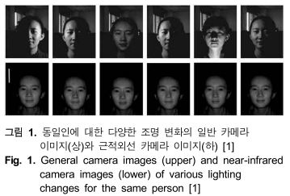

<br />

-> (얼굴인식에 근적외선을 이용하려 했으나,) 충분한 양의 근적외선 얼굴 데이터를 만드는 것이 쉽지 않다.

<br />

```CycleGAN```

- 쌍이 없는 데이터 학습 / 일반적인 RGB 얼굴 이미지로부터 / 근적외선 얼굴 이미지를 만들기
- ```Perceptual 손실함수``` 추가

<br />

- ```얼굴 이미지 정렬``` / 해당하는 랜드마크를 찾아 정렬
- ```히스토그램 평활화```

-> 가짜 생성 이미지 품질 향상

<br /><br /><br />

---

### 2. 관련 연구

#### 1. Illumination invariant face recognition using near-infrared images

- LBP(Local Binary Pattern) 특징 추출 / 조명에 무관한 얼굴 표현 / AdaBoost<br />
  -> 인식 정확성 및 속도 개선
- 햇빛이 강한 실외에서 얻은 / 인식성능이 떨어지는 단점 / 데이터를 충분히 확보하는 것이 어려움

근적외선 카메라로 다양한 얼굴 데이터를 대량으로 수집하는 것의 어려움<br />
-> 부족한 근적외선 영상 데이터를 GAN을 기반으로 / 이미지를 생성하는 방법 제안

<br />

GAN: Generative Adversarial Network (Ian Goodfellow)

- 두 개의 신경망(Generator, Discriminator)이 서로 경쟁<br />
  -> Generator가 입력으로 주어진 데이터의 분포와 비슷한 데이터를 생성
- 두 신경망이 경쟁하며 학습되기 때문에 학습이 불안정함.

<br />

- (Conditional GAN) Pix2Pix
  - 입력 이미지와 출력 이미지의 매핑 관계 학습
  - 이미지가 쌍으로 주어질 때는 학습 가능함.

<br />

```CycleGAN```

- 쌍으로 주어지지 않은 데이터를 학습하기 위해
- Cycle consistency 손실함수
  - F(G(X)) = X를 확인
  - 기본적으로 pixel 단위로 확인하지만, 특징 간의 손실을 계산할 수도 있음.<br />
    -> 얼굴 특징을 보존하는 방향으로 손실을 활용해서 주요 특징들이 잘 보존됨.

<br />

- Facial Feature Embedded CycleGAN for VIS-NIR Translation
  - CycleGAN's Encoder -> 얼굴 특징 추출기로 교체
  - Pixel consistency 손실 제안
  - 일반 카메라 얼굴 이미지를 근적외선 얼굴 이미지로 변환하는 방법 제안

-> new loss가 데이터 쌍을 확보하지 못한 경우에는 사용할 수 없음.

<br />

- 얼굴 정렬: 눈 영역의 랜드마크를 검출하여 얼굴을 정렬

> 입력되는 얼굴 이미지를 정렬시키고 명암 대비를 개선<br />-> 생성한 이미지의 품질 향상

<br /><br /><br />

---

### 3. NIR 얼굴 이미지 생성

#### 3-1. 제안 방법의 개요

|                     |                                 |
| ------------------- | ------------------------------- |
| VIS (Visual)        | 일반적인 카메라로 촬영한 이미지 |
| NIR (Near-Infrared) | 근적외선 차메라로 촬영한 이미지 |
|                     |                                 |

Generator의 입력을 만들 때

- 얼굴 정렬
  - 얼굴 랜드마크 검출 ```by One Millisecond Face Alignment with and Ensemble of Regression Trees```
  - 양쪽 눈의 위치를 찾아 그 위치를 기준으로 얼굴 정렬
- 히스토그램 평활화 ```by Image enhancement by Histogram equalization```
  - 얼굴 명도 대배 개선
  - ```NIS -> F -> VIS```에만 이용

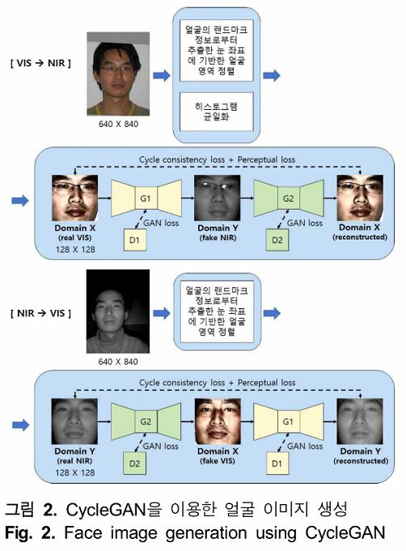

<br /><br />

#### 3-2. 눈 위치 기반 얼굴 정렬

CycleGAN의 입력 이미지에서 / 얼굴의 특징적인 부분들이 / 일정한 위치로 입력되면 / 손실함수 계산 시에 이점이 있다.<br />
-> 찾아진 양쪽 눈의 좌표를 이용하여 / 얼굴의 비틀어짐을 교정하는 방식 채택

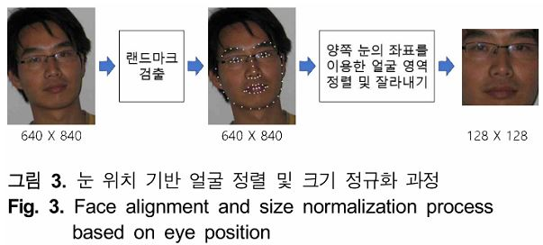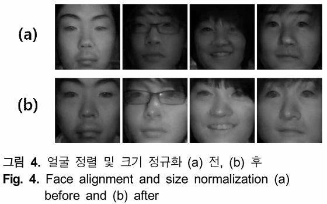

<br /><br />

#### 3-3. 얼굴 명도 조절

VIS 이미지는 조명이 너무 어둡거나 밝으면 명암 대비가 낮다.<br />
-> ```히스토그램 평활화``` 적용 -> 명앙 대비 향상


- 그림 5(b)의 히스토그램 평활화가 적용된 VIS 이미지는 NIR 이미지를 생성하기 위한 입력 이미지로 사람이 보는 시각적인 면에서 편하게 보이지 않을 수 있다.

<br />

#### 3-4. 근적외선 이미지 생성

Cycle consistency 손실 개념
  - 한쪽 도메인에 속한 데이터를 다른 쪽 도메인의 분포로 매핑
  - > 영어를 프랑스어로 번역한 후 그것을 다시 영어로 번역하면 원본 영어 문장과 같아야 한다.

<br />

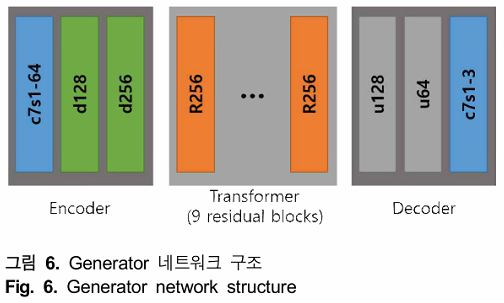

- c7s1-k = 7X7 size, stride 1인 filter k개를 이용하는 Convolution-InstanceNorm-ReLU layer
- dk = c3s2-k = 3X3 size, stride 2인 filter k개를 이용하는 Convolution-InstanceNorm-ReLU layer
- Rk: 3X3 size, filter k개를 이용하는 Convolution layer 2개가 있는 Residul block
- uk: stride 1/2, filter k개를 이용하는 Fractional-strided-Convolution-InstanceNorm-ReLU layer
  - alike Up-sampling
- 필터 수를 3으로 하면서 이미지 하나로

<br />

|                          |                                                                                                                                                                                                                                                                      |                                                                    |                                                                                                                                                                                                                                                                            |
| :----------------------: | :------------------------------------------------------------------------------------------------------------------------------------------------------------------------------------------------------------------------------------------------------------------: | :----------------------------------------------------------------: | :------------------------------------------------------------------------------------------------------------------------------------------------------------------------------------------------------------------------------------------------------------------------: |
|   Batch Normalization    | 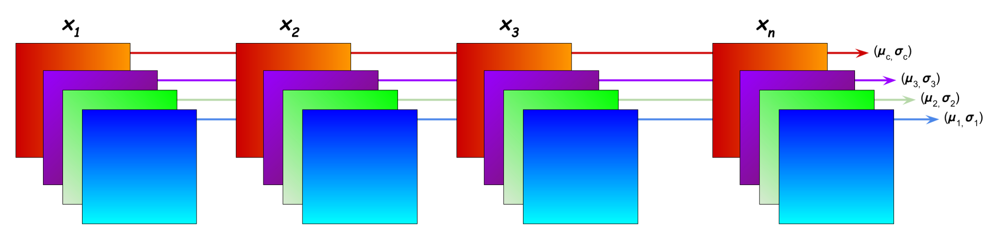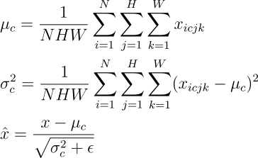 |                       Instance Normalization                       | 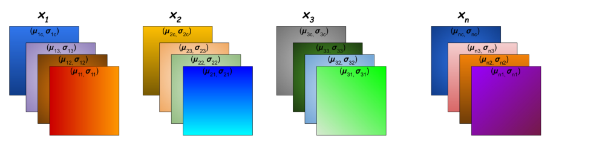 |
| (general) 2d convolution |                                                                                       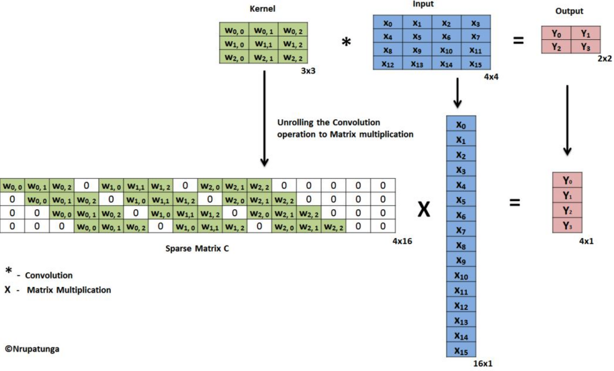                                                                                       | 2d transpose convolution<br >- 2d fractionally strided convolution |                                                                                         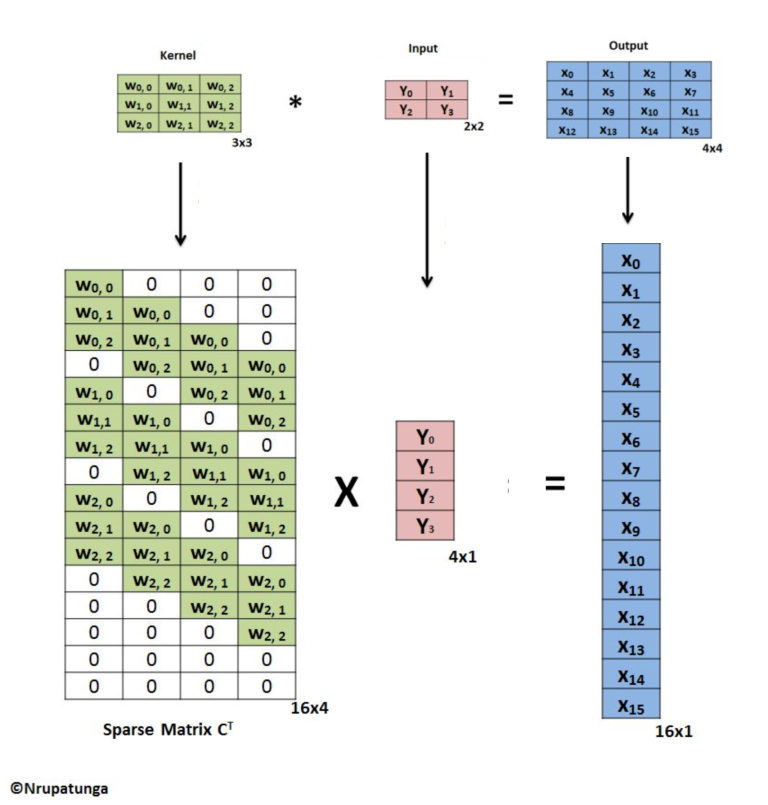                                                                                         |

<br />

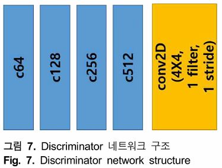

- Decoder = 70X70 크기의 ```PatchGAN Discriminator```
- ck = c4s2-k = 4X4 size, stride 2인 filter k개를 이용하는 Convolution-InstanceNorm-LeakyReLU layer

<br />

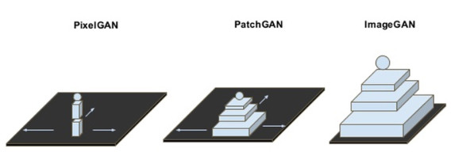

<br />

```Perceptual 손실함수``` = Content loss + Adversarial loss

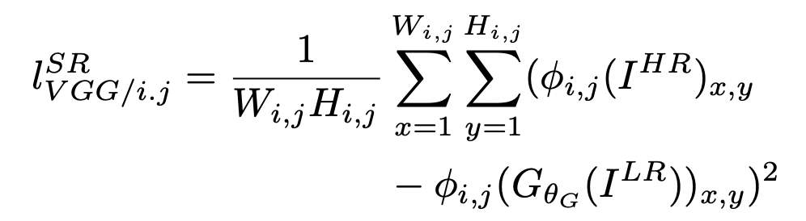

- 지각 손실 or VGG loss
- VGG16 모델의 4, 9, 16, 23번째 층에서 각각 Real 이미지와 Recon 이미지의 특징 간의 MSE 평균 이용
- 마지막 output에 대해서 loss를 구하는 것이 아니라 ith layer output을 가지고 loss를 구하겠다는 의미<br />
  -> feature map끼리 loss를 계산하므로 feature에 더 집중한다

-> VGG16에 실제와 생성된 이미지를 넣고 4, 9, 16, 23 layer의 (output) layer feature map으로 오차평균 내서 전체 평균낸 걸 loss에 반영하겠다.

<br />

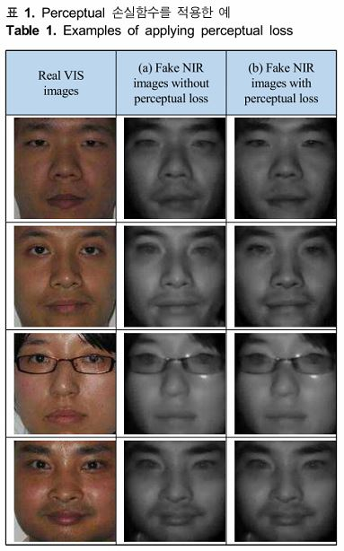

- 얼굴에서 의미 있는 특징 부위들을 개선하는 역할
- 전처리만 / 전처리 + Perceptual loss 추가
- 눈, 코, 입 등의 특징 부위와 얼굴의 볼 등이 / 선명하게

<br /><br /><br />

---

### 4. 실험 및 결과

#### 4-1. 실험 데이터

CASIA NIR-VIS 2.0

- Chinese Academy of Sciences, Institute of Automation
- 대부분 동양인
- 모두 참여한 Subject는 530명

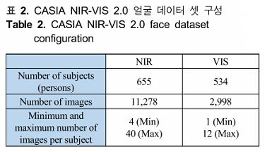

<br />

#### 4.2 정성적 평가

- A: 얼굴 정렬
- B: 얼굴 정렬 + 히스토그램 평활화
- C: 전처리(얼굴 정렬 + 히스토그램 평활화) + Perceptual loss 추가 
- Subject당 3장에서 8장 사이만 이용<br />
  -> VIS 534 subjects 중에서 이미지 수가 한 장밖에 없는 subject 제외됨.
- VIS 2,966 (533 subjects) / NIR 4,301 (655 subjects)


- A: 생성된 이미지가 선명하지 않고 흐리게
- B: 얼굴의 그림자도 자연스럽게
- C: 얼굴의 그림자도 자연스럽게 + 주요 특징들이 더욱 선명하게

-> 제안한 방법으로 취득한 이미지가 진짜 NIR 이미지와 전반적으로 상당히 유사함.

<br />

#### 4-3. 정량적 평가

가짜 NIR 이미지를 포함시켜 학습해보자.

- 식별 변호로 얼굴 인식 -> 식별 번호 = 라벨
- VIS, NIR 모두 존재하는 530명 중, 이미지 수가 적은 10명 제외 = 520명 이용
- 전체 6,456 or 9,380
- 얼굴 인식기: Inception-ResNet-v1 learned by CASIA webface dataset
- 다른 생성기로 만들어진 학습 데이터셋 / 같은 classifier

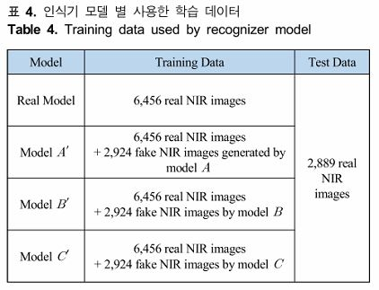

> 제안한 방법으로 생성한 가짜 데이터를 학습에 포함하여 사용했을 때 인식성능을 높이는 데 도움이 된 것

<br /><br /><br />

---

### 5. 결론

- 부족한 학습 데이터에 가짜로 생성한 데이터를 추가하여 학습할 때 / 성능이 개선
- 간단한 이미지 전처리와 특징 기반의 Perceptual 손실함수를 추가
- 다양한 인종이 혼합된 데이터 사용 -> 지역에 상관없이 조명 변화에 강인한 얼굴 이미지를 생성하는 시스템으로 개선
- 극심한 고통을 포함하는 다양한 얼굴 표정 인식을 위한 데이터 생성에도 개선하여 활용하고자 함.
